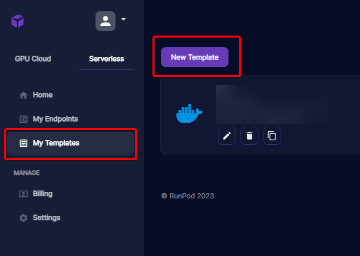
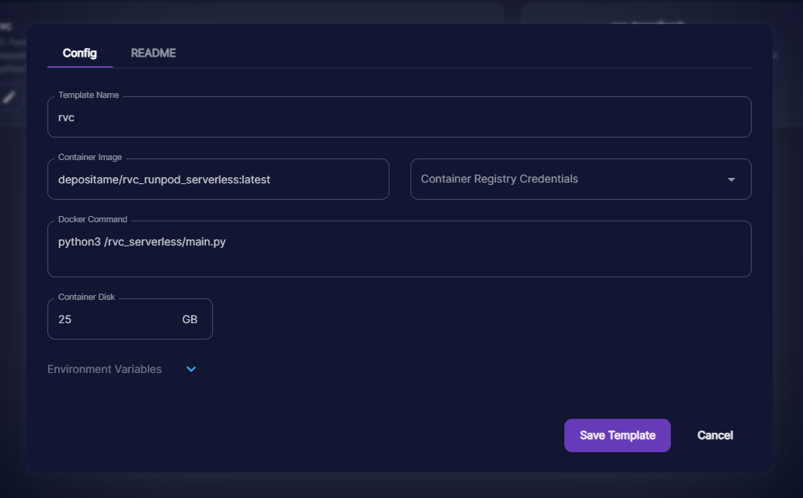
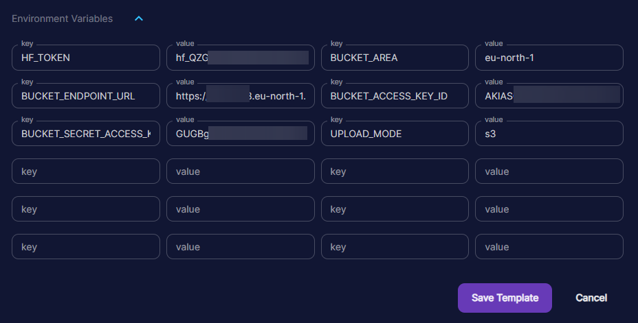
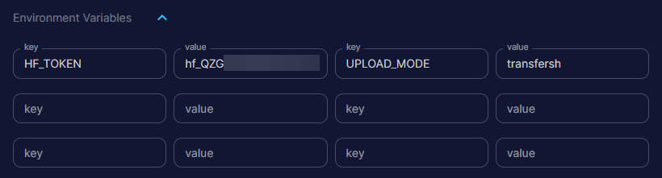
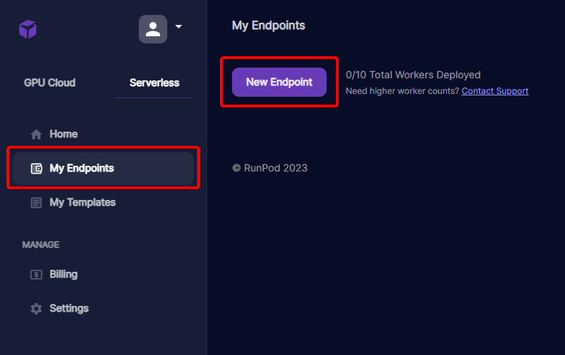
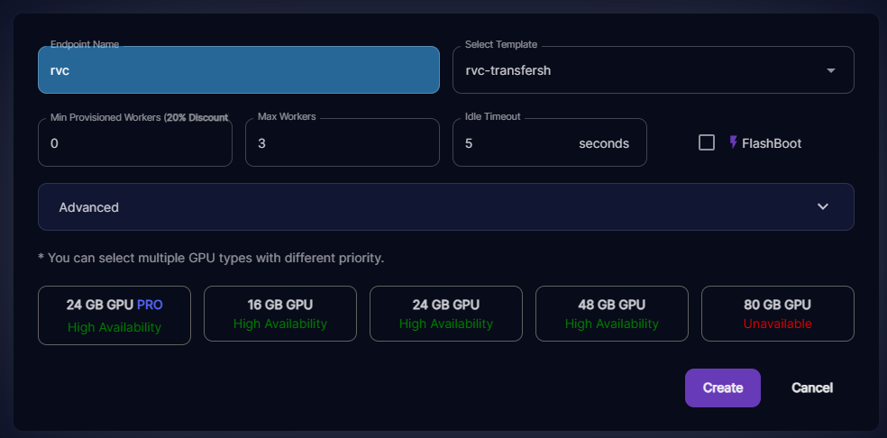
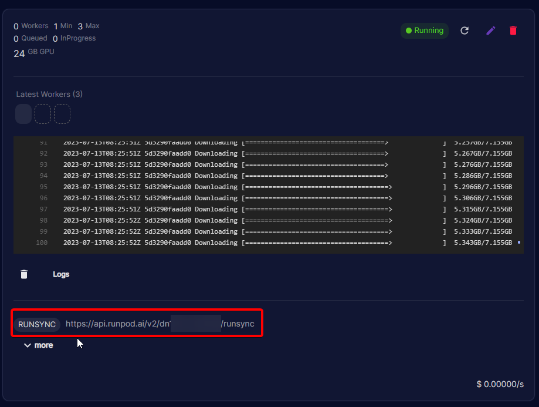

# Build the Docker (Optional)

A pre-built docker image is available at: https://hub.docker.com/repository/docker/depositame/rvc_runpod_serverless/general

It might not be updated.

Clone the repository

```
git clone https://github.com/chavinlo/rvc-runpod/
```

Build the Docker; Change `YOURDOCKERHUBUSER` for your Docker Hub Username. You must have also logged in previously via `docker login --username=YOURDOCKERHUBUSER --password=YOURPASS`

```
cd rvc-runpod
docker build -t rvc .
docker tag rvc:latest YOURDOCKERHUBUSER/rvc_runpod_serverless:latest
docker push YOURDOCKERHUBUSER/rvc_runpod_serverless:latest
```

# Prepare the models

ModelManager obtains their models via the HuggingFace Hub. This allows using multiple models in a single server by simply stating it in the requests. The models are automatically downloaded and cached, handled by the HuggingFace hub python package.

Models must follow the following structure:

```
sail-rvc/example
├── config.json
├── model.index
└── model.pth
```

Where:

- Config.json: JSON file stating the model architecture, version, components paths (pth & index), and (optionally) the metadata JSON.
- model.index: Path to the feature index file in the HuggingFace repository.
- model.pth: Path to the "Infering voice" model file in the HuggingFace repository.

An example model is available at: https://huggingface.co/sail-rvc/example

# Setting up the RunPod Serverless Endpoint

Go to `Serverless` > `My Templates` and click on `New Template`



Fill the form out with the following information:

- Template Name: rvc (or anything you want)
- Container Image: Pre-built one is `depositame/rvc_runpod_serverless:latest`; Path to your container Image in Docker Hub.
- Docker Command: `python3 /rvc_serverless/main.py`
- Container Disk: `25GB`

Should end up looking like this:



Now click on `Enviroment Variables`, and create the following:

Format is KEY: VALUE

- `HF_TOKEN`: HuggingFace Token (Mandatory). Obtain yours at https://huggingface.co/settings/tokens

### If using S3
- `UPLOAD_MODE`: `s3` (Case Sensitive!)
- `BUCKET_ENDPOINT_URL`: S3 Endpoint URL
- `BUCKET_ACCESS_KEY_ID`: S3 Access Key ID
- `BUCKET_SECRET_ACCESS_KEY`: S3 Secret Access Key
- `BUCKET_AREA`: S3 Bucket Area (ex.: `eu-north-1`)
### If using transfer.sh
- `UPLOAD_MODE`: `transfersh` (Case Sensitive!)
Note that, transfer.sh will delete the files after 2 weeks.

Should look like this if using S3:


Or like this if using transfer.sh:


Click on `Save Template`; Go to `Serverless` > `My Endpoints`.

Click on `New Endpoint`



Fill out the form with the following information:

- Endpoint Name: rvc (or anything you want)
- Select Template: Select the template we have just created in the prior step.
- Min Provisioned Workers: `0`; Minimun amount of workers (unkillable)
- Max Workers: `3`; Maximun amount of workers (Killable)
- Idle Timeout: `120`; Idle Timeout (Seconds)
- FlashBoot: `True/Enabled`; Faster Bootup for new instances

Select the GPU of your choice.
Should end up looking like this:



Click `Create`.

Your endpoint will be deploying and initializing. During the first time it will take from 3-8 minutes.

You can click on the endpoint to see more information about it, along with the workers logs.

Inside it, you will get a `RUNSYNC` URL. You can make `POST` requests to this URL and get the response. Note that you have to create an API key and use it as BEARER authentication on the request or it will throw `401 UNAUTHORIZED`.



# Using the endpoint

You may send requests in the following format:

```JSON
{
    "input": {   
        "arguments": {
            "audio_url": "https://cdn.discordapp.com/attachments/1128020045948272640/1128631615355105280/Berg_More_Than_I_Am_Lead_Vox_mp3.mp3",
            "model_name": "sail-rvc/example",
            "transpose": 0,
            "pitch_extraction_algorithm": "crepe",
            "search_feature_ratio": 0.76,
            "filter_radius": 3,
            "resample_output": 0,
            "volume_envelope": 0.25,
            "voiceless_protection": 0.1,
            "hop_len": 128
        }
    }
}
```

Most of the arguments are just the parameters you would see on a RVC-WEBUI.

The most important parts are:

- `audio_url`: Direct URL to the audio, this will be downloaded by the endpoint.
- `model_name`: Model name as it is on huggingface. It can be a private repository, but you must have set a `HF_TOKEN` in the previous steps that has access to it.

The returned response should look like the following:

```JSON
{
    "delayTime": 49,
    "executionTime": 14579,
    "id": "sync-RUNPOD-TASK-ID",
    "output": {
        "body": {
            "audio_url": "PUBLIC DIRECT URL TO AUDIO",
            "success_message": "SUCCESS MESSAGE WITH TIMING AND MODEL PATH"
        },
        "statusCode": 200
    },
    "status": "COMPLETED"
}
```

`audio_url` is what you are looking for. It will point directly to the audio.

In the case the operation fails, or one of the parameters is out of range/missing, the status code will be 400/300. So in order to detect this you can do a simple `if response["output"]["statusCode"] != 200` to detect it.